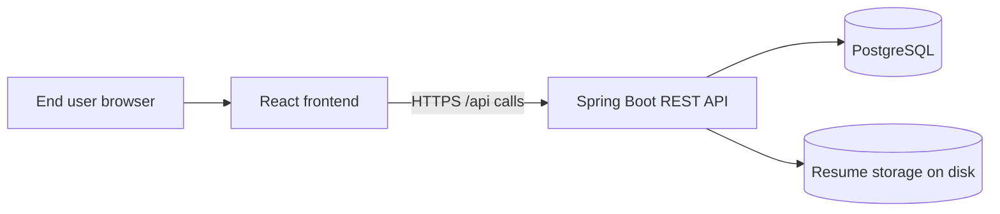

# ATS Platform HLD and LLD

This document is a practical design brief for ATS Platform. It explains what the system is, how it is built, what is already delivered, what remains to be built, and how the architecture can scale.

## 1. Product overview

ATS Platform is a role-based applicant tracking system for two user groups:

- Candidates browse jobs, apply, and upload resumes
- Recruiters create and manage jobs, review applicants, update status, and inspect resume match scores

The codebase is a full-stack monorepo with a Spring Boot backend and a React frontend.

### Technology stack

- Backend: Java 17, Spring Boot 3.5, Spring Security, Spring Data JPA, Flyway, OpenAPI, JWT
- Frontend: React 19, TypeScript, Vite, React Router, TanStack Query, React Hook Form, Zod
- Database: PostgreSQL
- File handling: local filesystem storage for resumes
- Document parsing: Apache Tika
- Local development: Docker Compose

## 2. High-Level Design (HLD)

### 2.1 System context

The application is designed as a split full-stack system:

The frontend only handles presentation and client-side routing. The backend owns authentication, business rules, persistence, file storage, and scoring.

### 2.2 Main user roles

- Candidate
- Recruiter
- Admin exists in the domain model, but the current public registration flow is limited to candidate and recruiter accounts

### 2.3 Core business capabilities

The implemented product flow is:

1. Register and log in with JWT
2. Browse open jobs publicly
3. View job details and apply as a candidate
4. Recruiters create and manage jobs for their company
5. Recruiters review applications and update status or notes
6. Candidates upload PDF or DOCX resumes
7. The backend extracts resume text and calculates a deterministic match score

### 2.4 Architectural style

The backend follows a layered architecture:

- Controller layer for HTTP endpoints
- Service layer for business rules
- Repository layer for database access
- Domain layer for entities and enums
- Config and security layer for auth, CORS, OpenAPI, and web settings

The frontend follows a routed page-based architecture with shared auth state and query-based API access.

### 2.5 Scalability direction

The current architecture is already suitable for a small production deployment and can be scaled in stages:

- Scale reads with pagination and query optimization
- Scale frontend independently from backend
- Replace local resume storage with object storage when deploying beyond a single server
- Introduce Redis later for caching, rate limiting, or computed scoring if needed
- Move match scoring to async processing if upload traffic grows

## 3. Low-Level Design (LLD)

### 3.1 Backend module breakdown

#### Authentication

Files and responsibilities:

- `AuthController` handles register and login requests
- `AuthService` creates users and issues JWTs
- `JwtService` signs and validates tokens
- `SecurityConfig` enforces stateless auth and role checks

What it does today:

- Email/password registration
- Login with JWT access token
- Role-based authorization for protected endpoints

#### Users and accounts

- `User` stores email, hashed password, role, company link, and enabled flag
- `Company` stores the recruiter company name and owns users and job postings
- `UserController` exposes `/api/me`

#### Jobs

- `PublicJobController` exposes open job search and job detail reads
- `RecruiterJobController` handles create, list, update, and delete for company-owned jobs
- `JobPostingService` contains the business rules for ownership, validation, and search
- `JobSpecifications` supports public filtering by query text and location

Key rules:

- Public users can only see open jobs
- Recruiters can only manage jobs that belong to their company
- Salary validation prevents invalid min/max combinations

#### Applications

- `CandidateJobApplicationController` lets candidates apply to open jobs
- `MeApplicationsController` lists the signed-in candidate’s applications
- `RecruiterApplicationController` lists and updates applications for a recruiter’s company jobs
- `JobApplicationService` enforces one application per candidate per job and protects ownership

Key rules:

- One candidate can apply only once per job
- Recruiters can only see applications for jobs in their own company
- Application status and recruiter notes are stored on the application record

#### Resume upload and scoring

- `CandidateResumeController` accepts multipart file uploads
- `CandidateResumeService` validates the upload, extracts text, stores the file, and writes scoring metadata
- `ResumeTextExtractor` parses PDF and DOCX content with Apache Tika
- `AtsMatchScoringService` calculates a deterministic 0-100 score and explanation strings
- `LocalResumeStorage` stores the file on disk

Key rules:

- Only candidates can upload resumes
- Only the owner of the application can upload to it
- Allowed file types are validated before parsing
- Uploaded file size is limited by config

#### Data model

Main entities:

- `User`
- `Company`
- `JobPosting`
- `JobApplication`

Important relationships:

- A company has many users and many job postings
- A user may belong to one company
- A job posting belongs to one company
- A job application belongs to one job posting and one candidate

### 3.2 Frontend module breakdown

#### App shell and routing

- `App.tsx` defines the layout, navigation, and role-gated routes
- `RequireRole` protects recruiter and candidate pages

#### Pages already implemented

- Home page with product summary and entry points
- Jobs list page for public browsing
- Job detail page with apply action for candidates
- Login and register pages
- Account page
- Health page
- My applications page for candidates
- Recruiter jobs list and recruiter job form pages
- Job applications page for recruiters

#### Client-side data flow

- TanStack Query handles server state, caching, and invalidation
- React Hook Form and Zod manage form validation
- The auth provider stores the signed-in user and JWT
- The Vite dev proxy sends local `/api` and `/actuator` calls to the backend

## 4. What is already done

The current codebase already delivers these parts end to end:

- JWT auth and role-based access control
- Candidate and recruiter registration and login
- Public job search and job details
- Recruiter CRUD for company-owned jobs
- Candidate application flow
- Recruiter application review and status updates
- Resume upload for candidates
- Resume text extraction from PDF and DOCX
- Match score generation with explanations
- Responsive routed frontend for both user roles
- Swagger/OpenAPI exposure for API exploration
- Local Docker Compose infrastructure for PostgreSQL and Redis

## 5. What is not done yet

The following development areas are not implemented yet and remain future work:

- Interview scheduling and interview tracking
- Email or notification workflow
- Recruiter analytics dashboards
- Candidate timeline and richer application history views
- AI-generated interview questions
- Advanced scoring with embeddings or LLMs
- Production-grade object storage for resumes
- Background async processing for heavy resume or scoring workloads

## 6. Development roadmap by phase

### Phase 0: foundation

Status: done

Delivered:

- Repo structure
- Docker Compose for local infrastructure
- Backend skeleton and frontend skeleton
- Environment templates
- CI pipeline

### Phase 1: identity and core domain

Status: done

Delivered:

- Register and login
- JWT auth
- User roles
- Company and core entity model
- `/api/me`

### Phase 2: jobs and applications

Status: done

Delivered:

- Public job browsing
- Recruiter CRUD for jobs
- Candidate apply flow
- Recruiter application review
- Pagination and validation

### Phase 3: resume upload and match score

Status: done for v1

Delivered:

- Resume upload endpoint
- File validation
- Local file storage
- Apache Tika extraction
- Deterministic ATS score and reasons

### Phase 4 and beyond: product growth

Status: planned

Suggested next slices:

- Recruiter analytics and funnel views
- Candidate application history and timeline
- Interview scheduling
- Notifications
- Optional AI-assisted questions
- Production deployment hardening

## 7. Scalability considerations

### 7.1 API scalability

- Keep endpoints paginated
- Continue using DTOs instead of exposing entities
- Add indexes on common filters and foreign keys
- Move expensive resume work off the request path if traffic grows

### 7.2 Storage scalability

- Current local filesystem storage is fine for development and demos
- For production or shared hosting, move resumes to object storage such as S3-compatible storage
- Keep database records for metadata and status, not file bytes

### 7.3 Scoring scalability

- Current scoring is synchronous and deterministic
- If volume increases, queue the scoring step or recalculate asynchronously
- Keep the scoring interface stable so the implementation can evolve later

### 7.4 Frontend scalability

- Split more screens into focused route components as the product grows
- Keep server-state logic in query hooks
- Continue role-gated routes for clean user separation

## 8. End-user presentation summary

This is the concise product story you can show to a user or stakeholder:

- Candidates can register, browse jobs, apply, and upload resumes
- Recruiters can post jobs, review applicants, and update application status
- The system gives a visible resume match score and reasons
- The app is built on a modern API + UI stack and is structured for future growth

## 9. Recommended next documents

- `docs/INTRODUCTION.md` for a shorter overview
- `README.md` for local setup and current phase summary
- `DEVELOPMENT_PLAN.md` for the long-term roadmap
- `PROJECT_PROGRESS.md` for the authoritative done/not-done checklist
- `DEPLOYMENT.md` for production hosting guidance
